Casco Bay CSO Exploratory Analysis and Graphics
================
Curtis C. Bohlen, Casco Bay Estuary Partnership
03/19/2021

-   [Load Libraries](#load-libraries)
-   [Load DEP Data](#load-dep-data)
    -   [Establish Folder References](#establish-folder-references)
-   [Load Weather Data](#load-weather-data)
    -   [Establish Folder Reference](#establish-folder-reference)
    -   [Access data](#access-data)
    -   [Examine Correlations](#examine-correlations)
-   [Refine Data](#refine-data)
    -   [Identify Casco Bay CSO Communities by
        Name](#identify-casco-bay-cso-communities-by-name)
    -   [Casco Bay Towns Data](#casco-bay-towns-data)
    -   [Totals Data](#totals-data)
-   [Correlations by Year](#correlations-by-year)
    -   [Merge Three Data Sets](#merge-three-data-sets)
-   [Generate Models and Extract
    Coefficients](#generate-models-and-extract-coefficients)
-   [Plot Three Models](#plot-three-models)
-   [Diagnostic Plots](#diagnostic-plots)
    -   [Log Least Squares Models](#log-least-squares-models)
    -   [Log Median Based Models](#log-median-based-models)
    -   [Untransformed Median Based
        Models](#untransformed-median-based-models)
    -   [Least Squares Models Are The
        Best](#least-squares-models-are-the-best)
    -   [Commentary](#commentary)
-   [Calculate Annual Percent
    Changes](#calculate-annual-percent-changes)
    -   [Casco Bay - Wide Reductions over
        23-Years](#casco-bay---wide-reductions-over-23-years)
    -   [Calculate Long Term
        Reductions](#calculate-long-term-reductions)


# Load Libraries

``` r
library(tidyverse)
#> -- Attaching packages --------------------------------------- tidyverse 1.3.0 --
#> v ggplot2 3.3.3     v purrr   0.3.4
#> v tibble  3.0.5     v dplyr   1.0.3
#> v tidyr   1.1.2     v stringr 1.4.0
#> v readr   1.4.0     v forcats 0.5.0
#> -- Conflicts ------------------------------------------ tidyverse_conflicts() --
#> x dplyr::filter() masks stats::filter()
#> x dplyr::lag()    masks stats::lag()

library(CBEPgraphics)
load_cbep_fonts()
theme_set(theme_cbep())

library(corrplot)
#> corrplot 0.84 loaded

library(mblm)  # Includes a Theil-Sen estimator, and an extension by Seigel
```

# Load DEP Data

## Establish Folder References

``` r
sibfldnm <- 'Derived_Data'
parent   <- dirname(getwd())
sibling  <- file.path(parent,sibfldnm)

dir.create(file.path(getwd(), 'figures'), showWarnings = FALSE)
```

``` r
fn <-'DEP_Annual_Totals.csv'
fpath <- file.path(sibling, fn)
the_data <- read_csv(fpath, col_types = 
                       c(Community = col_character(),
                         Year = col_integer(),
                         Volume = col_double(),
                         Events = col_double(),
                         Outfalls = col_double()))
```

# Load Weather Data

## Establish Folder Reference

``` r
sibfldnm <- 'Original_Data'
parent   <- dirname(getwd())
sibling  <- file.path(parent,sibfldnm)
```

## Access data

We extract annual Precipitation Totals (in mm), and Annual Days with
more than one tenth of an inch (2.5mm), and one inch (25.4mm) of rain
from the annual weather summaries from NOAA.

``` r
fn <-'Annual_Weather_PWD.csv'
fpath <- file.path(sibling, fn)
rain_data <- read_csv(fpath, col_types =
                       cols(date = col_datetime(format = ""),
                            datatype = col_character(),
                            value = col_double(),
                            attributes = col_character(),
                            station = col_skip())) %>%
  mutate(Year = as.integer(format(date, format = '%Y'))) %>%
  filter (datatype %in% c('PRCP', 'DP10', 'DP1X')) %>%
  select(Year, datatype, value) %>%
  pivot_wider(names_from = datatype, values_from = value) %>%
  rename(Precip_mm = PRCP, GT0.1 = DP10, GT1.0 = DP1X) %>%
  mutate(Precip_in = Precip_mm / 25.4) %>%
  filter(Year > 1996)
```

## Examine Correlations

``` r
cor(rain_data, use = 'pairwise')
#>                Year     GT0.1     GT1.0 Precip_mm Precip_in
#> Year      1.0000000 0.2747309 0.2421001 0.2748405 0.2748405
#> GT0.1     0.2747309 1.0000000 0.5995589 0.7370457 0.7370457
#> GT1.0     0.2421001 0.5995589 1.0000000 0.8812085 0.8812085
#> Precip_mm 0.2748405 0.7370457 0.8812085 1.0000000 1.0000000
#> Precip_in 0.2748405 0.7370457 0.8812085 1.0000000 1.0000000
```

There are what are likely to be statistically significant correlations
between year and number of large storm and total rainfall even over this
short period. (See the Climate Change indicator for analysis of a longer
time series.)

The high correlation between number of large storms and total
precipitation may complicate separating those two factors in any
analysis – but we don’t really need to do that in this worksheet.

# Refine Data

## Identify Casco Bay CSO Communities by Name

``` r
cb_cso_towns <- c("Cape Elizabeth",
                "Portland & PWD",
                "South Portland",
                "Westbrook",
                "Yarmouth")            
```

## Casco Bay Towns Data

Although the number of events and outfalls were reported in the 2008 CSO
report for years prior to 2006, they show no variation, suggesting these
data are not meaningful, so we strip them out here.

``` r
cb_towns_data_long <- the_data %>%
  filter(Community %in% cb_cso_towns) %>%
  mutate(VolumeMG = Volume / (10^6)) %>%
  filter(Year > 1996)

cb_towns_data_wide <- cb_towns_data_long %>%
  pivot_wider(Year, names_from = Community,
              values_from = c(Volume, Events, Outfalls),
              names_repair = 'universal') %>%
  rename_with(~ sub('\\.\\.\\.', '.', .x )) %>% # replace triple dots in Portland
  rowwise() %>%
  mutate(Total = sum(c(Volume_Cape.Elizabeth,
                       Volume_Portland.PWD,
                       Volume_South.Portland,
                       Volume_Westbrook,
                       Volume_Yarmouth), na.rm = TRUE),
         PctPortland = Volume_Portland.PWD/Total) %>%
  ungroup()
#> New names:
#> * `Events_Cape Elizabeth` -> Events_Cape.Elizabeth
#> * `Events_Portland & PWD` -> Events_Portland...PWD
#> * `Events_South Portland` -> Events_South.Portland
#> * `Outfalls_Cape Elizabeth` -> Outfalls_Cape.Elizabeth
#> * `Outfalls_Portland & PWD` -> Outfalls_Portland...PWD
#> * ...
```

## Totals Data

Including total discharge volumes each year, in Millions of Gallons.

``` r
annual_data <- the_data %>%
  group_by(Year) %>%
  summarize(TotVol      = sum(Volume,   na.rm = TRUE),
            TotVolMG    = TotVol / (10^6),
            TotEvents   = sum(Events,   na.rm = TRUE),
            TotOutfalls = sum(Outfalls, na.rm = TRUE),
            
            CBTotVol      = sum(Volume*(Community %in% cb_cso_towns),
                                na.rm = TRUE),
            CBVolMG    = CBTotVol / (10^6),
            CBTotEvents   = sum(Events*(Community %in% cb_cso_towns),
                                na.rm = TRUE),
            CBTotOutfalls = sum(Outfalls*(Community %in% cb_cso_towns),
                                na.rm = TRUE),
            
            CBPctVol       = round(CBTotVol / TotVol, 4) * 100,
            CBPctEvents    = round(CBTotEvents / TotEvents, 4) * 100,
            CBPctOutfalls  = round(CBTotOutfalls / TotOutfalls, 4) * 100,
            .groups = 'drop') %>%
  filter(Year > 1996)
```

# Correlations by Year

## Merge Three Data Sets

``` r
annual_data_all <- rain_data %>%
  left_join(cb_towns_data_wide, by = 'Year') %>%
  select (-Total) %>%
  rename(PctCascoPortland = PctPortland) %>%
  left_join(annual_data, by = 'Year') %>%
  mutate(CSO_MG_per_inch = CBVolMG / Precip_in)
rm(annual_data, cb_towns_data_wide, rain_data, the_data)
```

``` r
cors <- cor(annual_data_all, use = 'pairwise')
#> Warning in cor(annual_data_all, use = "pairwise"): the standard deviation is
#> zero
corrplot(cors, method="circle", type = 'upper', tl.cex = .5)
```

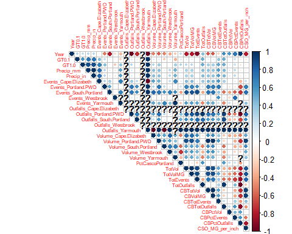

``` r
rm(cors)
```

What jumps out is:

1.  Year is negatively correlated with volume and events
2.  Year is positively (though not strongly) correlated with
    precipitation.
3.  Total CSO VOlumes and Events statewide are dropping even faster than
    in our region, so the percentage of the states CSOs from her is
    climbing.
4.  Volume and number of CSO events are correlated across the region.
    Bad years in one jurisdiction are bad for many.
5.  Portland’s CSOs are a big enough part of regional and state-wide
    totals so that they are always highly correlated with totals. The
    precipitation variables are not all that highly correlated with the
    other variables, but that

# Generate Models and Extract Coefficients

We want to extract slopes for the reduction in CSO volumes for each of
our communities. Since Yarmouth is no longer considered a CSO community,
we exclude them from the analysis.

Here we use the tidyverse’s nested tibbles (with list columns) to
automate identical statistical analyses for each town.

Given the high variability of CSO discharge numbers, and the strongly
non-normal structure of errors, it is unlikely that standard linear
regressions would be suited to documenting the rate of reduction in CSO
volumes. Here we calculate both linear regressions on log of discharges
and Theil-Sen median-based regressions (actually, a modification by
Seigel) untransformed data.

We use a log transformed analysis with the linear models as it better
addresses the structure of the data, and allows us to readily
reinterpret model coefficients in terms of an annual proportional
reduction in volumes.

In our initial CSO draft, we reported long term annual proportional
reductions in discharges, based on Theil-Sen slopes on log-transformed
data, but one reviewer objected to that presentation, in part because of
lack of clarity on our part of what the numbers presented
represented.That sent us back to the analysis, where we looked more
closely at model diagnostics, and concluded that the median-based models
had not performed very well on log-transformed data.

Statistical significance of a (bivariate) Theil-Sen slope estimate can
be evaluated via the test for significance of the closely-related
Kendall’s Tau correlation coefficient. We use `cor.test()` to test for
significance. We do not extract the p value of the linear models, as we
would not believe them anyway, but we do look at the related t
statistic, to help get a sense of the strength of the evidence
supporting a linear trend. The two methods give similar assessments of
which slopes are robust, although slope estimates differ somewhat.

``` r
res <- cb_towns_data_long %>%
  filter(Community != 'Yarmouth') %>%
  mutate(logVolume = log(Volume+100)) %>%
  group_by(Community) %>%
  nest() %>%
  mutate(mylm = map(data, function(df) lm(logVolume ~ Year, data = df)),
         lmslope = unlist(map(mylm, function(m) coef(m)[2])),
         lmsd = unlist(map(mylm,
                             function(m) coef(summary(m))[, 2][[2]])),
         tlm = lmslope/lmsd,
         lmp = unlist(map(mylm, function(m)coef(summary(m))[, 4][[2]])),
         
         myts = map(data, function(df) mblm(VolumeMG ~ Year, data = df)),
         tsslope = unlist(map(myts, function(m) coef(m)[2])),
         tsCortest = (map(data, function(df)
                     cor.test(df$Year, df$Volume, method = 'kendall'))),
         tscor = unlist(map(tsCortest, function(x) x$estimate)),
         tsp = unlist(map(tsCortest, function(x) x$p.value)),
         
         mylogts = map(data, function(df) mblm(logVolume ~ Year, data = df)),
         tslogslope = unlist(map(mylogts, function(m) coef(m)[2]))) %>%
        # Kendal's Tau and relate P value are identical for transformed and
        # untransformed values, since Kendal's Tau, which is based on order, not 
        # magnitude.
  select(-tsCortest)
#> Warning: Problem with `mutate()` input `tsCortest`.
#> i Cannot compute exact p-value with ties
#> i Input `tsCortest` is `(map(data, function(df) cor.test(df$Year, df$Volume, method = "kendall")))`.
#> i The error occurred in group 1: Community = "Cape Elizabeth".
res
#> # A tibble: 4 x 13
#> # Groups:   Community [4]
#>   Community data  mylm  lmslope   lmsd    tlm     lmp myts  tsslope  tscor
#>   <chr>     <lis> <lis>   <dbl>  <dbl>  <dbl>   <dbl> <lis>   <dbl>  <dbl>
#> 1 Cape Eli~ <tib~ <lm>  -0.0405 0.0766 -0.529 6.02e-1 <mbl~  -0.226 -0.323
#> 2 Portland~ <tib~ <lm>  -0.0725 0.0158 -4.58  1.63e-4 <mbl~ -45.5   -0.502
#> 3 South Po~ <tib~ <lm>  -0.0981 0.0275 -3.57  1.82e-3 <mbl~  -1.24  -0.470
#> 4 Westbrook <tib~ <lm>   0.0108 0.0625  0.172 8.65e-1 <mbl~  -0.532 -0.138
#> # ... with 3 more variables: tsp <dbl>, mylogts <list>, tslogslope <dbl>
```

# Plot Three Models

``` r
ts_preds <- tibble(Year = 1997:2019) %>%
  mutate(`Cape Elizabeth` = 
           predict(res[res$Community == 'Cape Elizabeth',]$myts[[1]])) %>%
  mutate(`Portland & PWD` = 
           predict(res[res$Community == 'Portland & PWD',]$myts[[1]])) %>%
  mutate(`South Portland` = 
           predict(res[res$Community == 'South Portland',]$myts[[1]])) %>%
  mutate(`Westbrook` = 
           predict(res[res$Community == 'Westbrook',]$myts[[1]])) %>%
  pivot_longer(`Cape Elizabeth`:Westbrook, 
               names_to = 'Community', 
               values_to = 'VolumeMG')

ts_log_preds <- tibble(Year = 1997:2019) %>%
  mutate(`Cape Elizabeth` = 
           predict(res[res$Community == 'Cape Elizabeth',]$mylogts[[1]])) %>%
  mutate(`Portland & PWD` = 
           predict(res[res$Community == 'Portland & PWD',]$mylogts[[1]])) %>%
  mutate(`South Portland` = 
           predict(res[res$Community == 'South Portland',]$mylogts[[1]])) %>%
  mutate(`Westbrook` = 
           predict(res[res$Community == 'Westbrook',]$mylogts[[1]])) %>%
  pivot_longer(`Cape Elizabeth`:Westbrook, 
               names_to = 'Community', 
               values_to = 'LogVol') %>%
  mutate(PredMG = exp(LogVol)/10^6)


lm_preds <- tibble(Year = 1997:2019) %>%
  mutate(`Cape Elizabeth` = 
           predict(res[res$Community == 'Cape Elizabeth',]$mylm[[1]])) %>%
  mutate(`Portland & PWD` = 
           predict(res[res$Community == 'Portland & PWD',]$mylm[[1]])) %>%
  mutate(`South Portland` = 
           predict(res[res$Community == 'South Portland',]$mylm[[1]])) %>%
  mutate(`Westbrook` = 
           predict(res[res$Community == 'Westbrook',]$mylm[[1]])) %>%
  pivot_longer(`Cape Elizabeth`:Westbrook, 
               names_to = 'Community', 
               values_to = 'LogVol')%>%
  mutate(PredMG = exp(LogVol)/10^6)
```

``` r
plt <- ggplot(cb_towns_data_long, aes(x = Year, y = VolumeMG)) +
  facet_wrap(~Community, scales = 'free_y') +
  geom_point() +
  geom_line(data = ts_preds, mapping = aes(Year, VolumeMG), color = 'blue') +
  geom_line(data = ts_log_preds, mapping = aes(Year, PredMG), color = 'violet') +
  geom_line(data = lm_preds, mapping = aes(Year, PredMG), color = 'red') +
  theme_cbep(base_size = 12)
```

``` r
plt
#> Warning: Removed 17 rows containing missing values (geom_point).
```

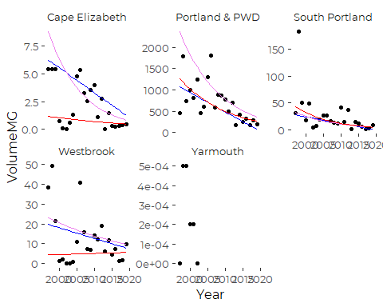

``` r
plt + scale_y_log10()
#> Warning: Transformation introduced infinite values in continuous y-axis
#> Warning: Removed 17 rows containing missing values (geom_point).
```

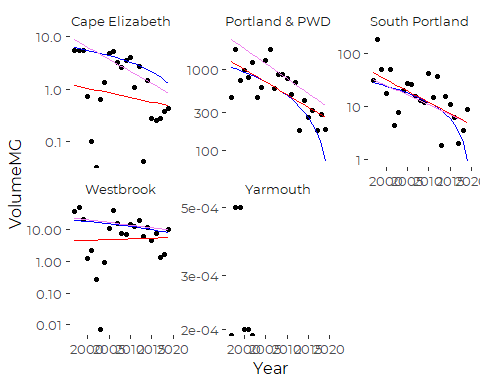

# Diagnostic Plots

## Log Least Squares Models

``` r
oldpar = par(mfrow = c(2,2))
for (c in res$Community){
  plot(res[res$Community == c,]$mylm[[1]], main = c)
}
```

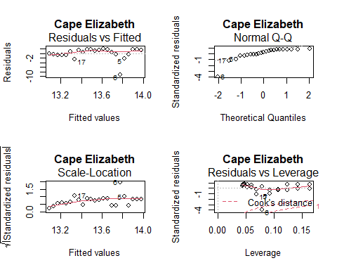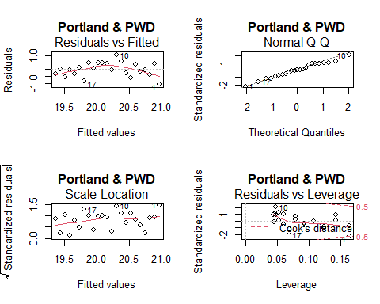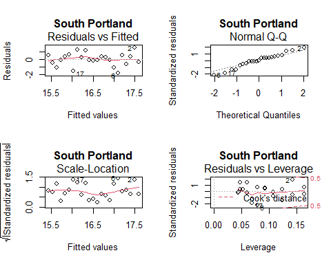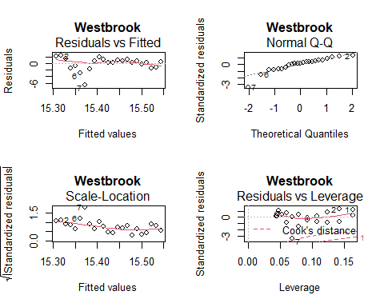

``` r
par(oldpar)
```

The residuals from the log-linear models are not bad. There are a few
outliers.  
We have no outliers wit hhigh leverage. These models are actually not
bad.

## Log Median Based Models

``` r
oldpar = par(mfrow = c(2,2))
for (c in res$Community){
  plot(res[res$Community == c,]$mylogts[[1]], main = c)
}
```

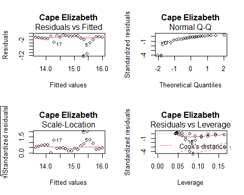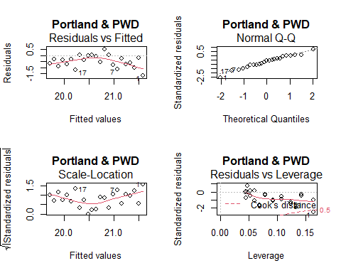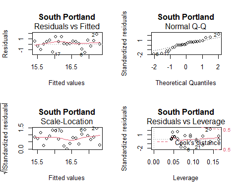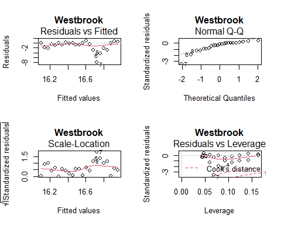

``` r
par(oldpar)
```

Note that the standardized residuals are NOT normally distributed and
indeed appear biased away from zero.

## Untransformed Median Based Models

``` r
oldpar = par(mfrow = c(2,2))
for (c in res$Community){
  plot(res[res$Community == c,]$myts[[1]], main = c)
}
```

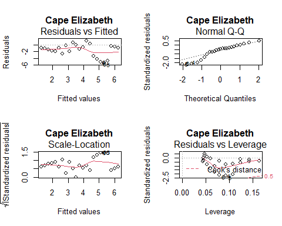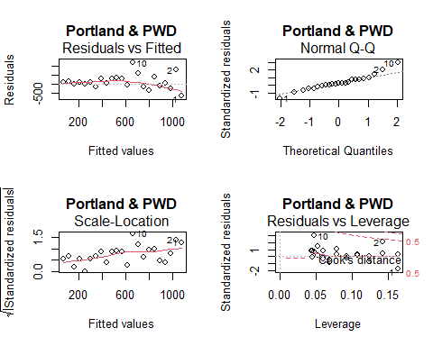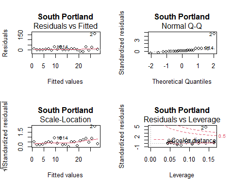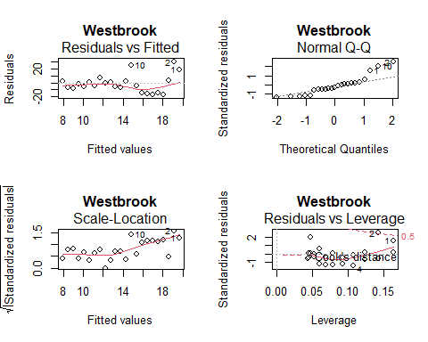

``` r
par(oldpar)
```

## Least Squares Models Are The Best

Of the three, the model diagnostics, especially the distribution of
residuals, look better for the least squares models.

It’s not clear why the Theil-Sen estimators are consistently above the
observed data.

## Commentary

None of those models perform well (looking on a linear scale) for all
communities. The linear models (red) perform best, especially when
viewed on a log scale, but they fail to reflect the very high early
discharges. While these models are STATISTICALLY appropriate, they fail
to communicate long-term trends to readers in an appropriate way – at
least without adding graphics.

# Calculate Annual Percent Changes

The relationship between log-transformed variables and percent change is
simply the following:

$$\\frac{y(t+1)-y(t))}{y(t)}=e^m-1$$
So, we can summarize the model results as follows:

``` r
res %>%
  select(Community, lmslope, tslogslope) %>%
  mutate(across(c(lmslope, tslogslope), ~ (exp(.)-1) * 100)) %>%
  rename(Ann_Pct_Chng_lm = lmslope,
         Ann_Pct_Chng_ts = tslogslope)
#> # A tibble: 4 x 3
#> # Groups:   Community [4]
#>   Community      Ann_Pct_Chng_lm Ann_Pct_Chng_ts
#>   <chr>                    <dbl>           <dbl>
#> 1 Cape Elizabeth           -3.97          -10.1 
#> 2 Portland & PWD           -6.99           -8.18
#> 3 South Portland           -9.35           -8.17
#> 4 Westbrook                 1.08           -3.82
```

These are statistically correct annual proportional reductions, but they
do not capture change, as pointed out by one of out reviewers.

## Casco Bay - Wide Reductions over 23-Years

We repeat the analysis, based on the sum of all discharges by town.

``` r
tmp  <- cb_towns_data_long %>%
  select(Year, Volume) %>%
  group_by(Year) %>%
  mutate(Total = sum(Volume, na.rm = TRUE)) %>%
  mutate(logVolume = log(Total + 100))        # + 100 for consistency
                                              # but not really needed here
  
overalllm <-  lm(logVolume ~ Year, data = tmp)
lmslope   <-  coef(overalllm)[2]
lmsd      <-  coef(summary(overalllm))[, 2][[2]]
tlm       <-  lmslope/lmsd


overallts <- mblm(logVolume ~ Year, data = tmp)
tsslope   <- coef(overallts)[2]

tsCortest <- cor.test(tmp$Year, tmp$logVolume, method = 'kendall')
tscor     <-  tsCortest$estimate
tsp       <-  tsCortest$p.value

cat('Linear Model Slope = ', lmslope, '\n')
#> Linear Model Slope =  -0.0738661
cat('t Statistic = ', tlm, '\n')
#> t Statistic =  -11.00852
cat('Related estimate of Annual Percent Change =',
    (exp(lmslope)-1) * 100, '\n')
#> Related estimate of Annual Percent Change = -7.120395
cat('Theil-Sen Slope = ', tsslope, '\n')
#> Theil-Sen Slope =  -0.07749891
cat('Related p value = ', tsp, '\n')
#> Related p value =  2.126838e-15
cat('Related estimate of Annual Percent Change =',
    (exp(tsslope)-1) * 100, '\n')
#> Related estimate of Annual Percent Change = -7.457197
```

## Calculate Long Term Reductions

Because the models do not really meet our needs, We calculate three year
mean and geometric mean discharges for the first three years and last
three years of our record. That may better capture the type of long-term
trend in a manner consistent with the request from our peer reviewers.

``` r
cb_totals <- cb_towns_data_long %>%
  group_by(Year) %>%
  summarize(Volume = sum(Volume, na.rm = TRUE),
            Outfalls = sum(Outfalls, na.rm = TRUE),
            VolumeMG = Volume / (10^6)) %>%
  mutate(Community = 'TOTAL')


tmp <- cb_towns_data_long %>%
  bind_rows(cb_totals) %>%
  mutate(selection = if_else (Year < 2000,
                              'Early',
                              if_else(Year > 2016, 'Recent',NA_character_))) %>%
    filter(! is.na(selection)) %>%
    mutate(Community = factor(Community, levels = c('Cape Elizabeth',
                                                    'Portland & PWD',
                                                    'South Portland',
                                                    'Westbrook',
                                                    'Yarmouth',
                                                    'TOTAL')))
```

``` r
tmp %>%
  replace_na(list(Volume = 0, Events = 0, VolumeMG = 0)) %>%
  group_by(Community, selection) %>%
  summarize(AvgVol    = mean(Volume),
            .groups = 'drop') %>%
  pivot_wider(Community, names_from = 'selection', values_from = AvgVol) %>%
  mutate(PctChange = 100* round(((Recent - Early)/Early),3))
#> # A tibble: 6 x 4
#>   Community            Early     Recent PctChange
#>   <fct>                <dbl>      <dbl>     <dbl>
#> 1 Cape Elizabeth    5400000     361333.     -93.3
#> 2 Portland & PWD  995481000  214580477      -78.4
#> 3 South Portland   87897466    4739643      -94.6
#> 4 Westbrook        36296000    4244000      -88.3
#> 5 Yarmouth              333.         0     -100  
#> 6 TOTAL          1125074799. 223925453.     -80.1
```
