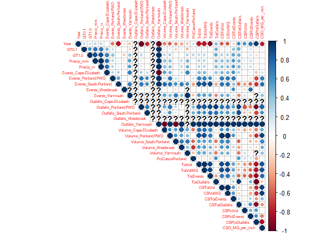
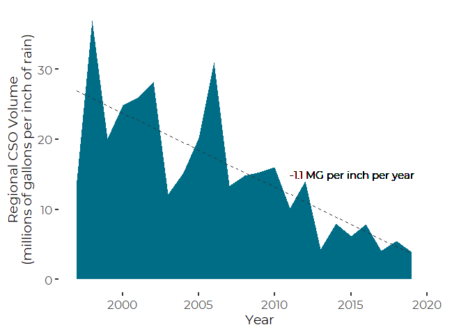
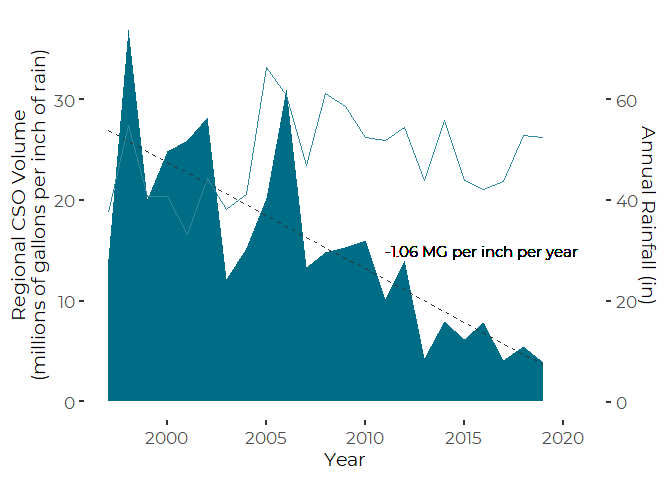
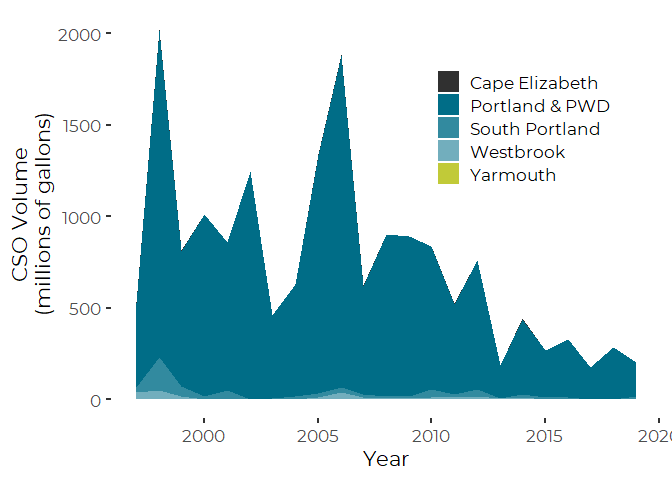
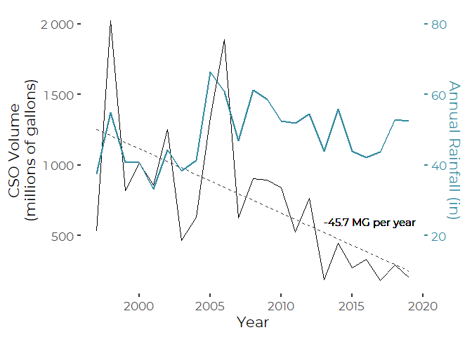
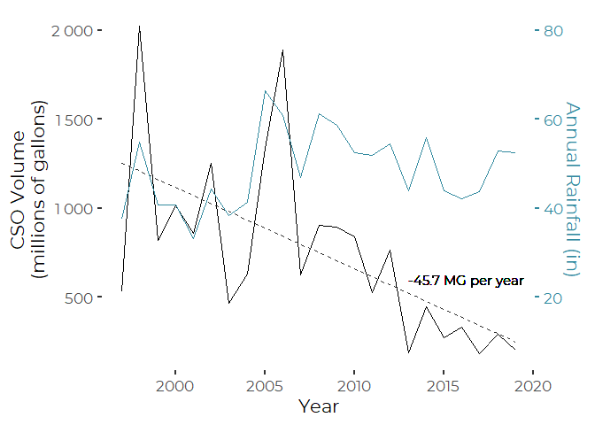
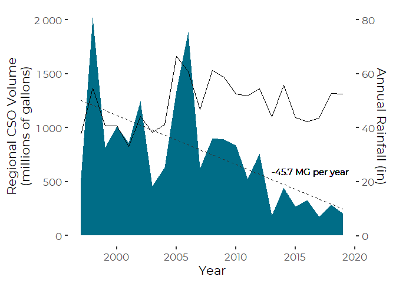
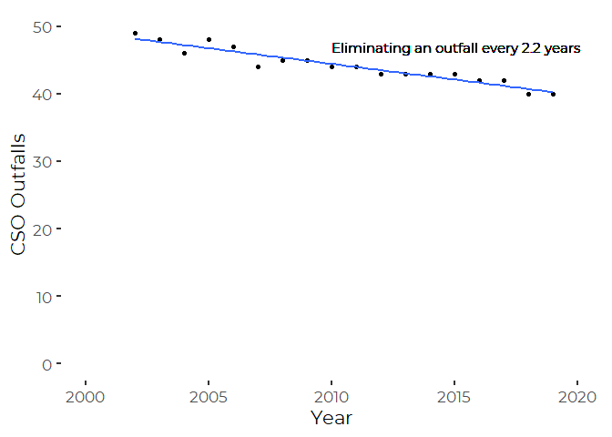

Casco Bay CSO Exploratory Analysis and Graphics
================
Curtis C. Bohlen, Casco Bay Estuary Partnership

  - [Load DEP Data](#load-dep-data)
      - [Establish Folder References](#establish-folder-references)
  - [Load Weather Data](#load-weather-data)
      - [Establish Folder Reference](#establish-folder-reference)
      - [Access data](#access-data)
      - [Examine Correlations](#examine-correlations)
  - [Identify Casco Bay CSO Communities by
    Name](#identify-casco-bay-cso-communities-by-name)
  - [Casco Bay Towns Data](#casco-bay-towns-data)
  - [Totals Data](#totals-data)
  - [Merge Three Data Sets](#merge-three-data-sets)
  - [Correlations by Year](#correlations-by-year)
  - [Graphics](#graphics)
      - [CSO Volumes Per Inch of Rain](#cso-volumes-per-inch-of-rain)
          - [Linear Model to Extract
            Slope](#linear-model-to-extract-slope)
      - [Regional CSO Volumes (by Town)](#regional-cso-volumes-by-town)
          - [Linear Regression to Extract
            Slope](#linear-regression-to-extract-slope)
      - [Total Discharges](#total-discharges)
      - [Total Outfalls](#total-outfalls)
          - [Regression to Extract Slope](#regression-to-extract-slope)
      - [Total Events (NOT)](#total-events-not)
  - [Summary Table](#summary-table)


\#Load Libraries

``` r
library(tidyverse)
#> -- Attaching packages --------------------------------------------------------------------- tidyverse 1.3.0 --
#> v ggplot2 3.3.2     v purrr   0.3.4
#> v tibble  3.0.3     v dplyr   1.0.2
#> v tidyr   1.1.2     v stringr 1.4.0
#> v readr   1.3.1     v forcats 0.5.0
#> -- Conflicts ------------------------------------------------------------------------ tidyverse_conflicts() --
#> x dplyr::filter() masks stats::filter()
#> x dplyr::lag()    masks stats::lag()

library(CBEPgraphics)
load_cbep_fonts()
theme_set(theme_cbep())

library(corrplot)
#> corrplot 0.84 loaded
```

# Load DEP Data

## Establish Folder References

``` r
sibfldnm <- 'Derived_Data'
parent   <- dirname(getwd())
sibling  <- file.path(parent,sibfldnm)

dir.create(file.path(getwd(), 'figures'), showWarnings = FALSE)
```

``` r
fn <-'DEP_Annual_Totals.csv'
fpath <- file.path(sibling, fn)
the_data <- read_csv(fpath, col_types = 
                       c(Community = col_character(),
                         Year = col_integer(),
                         Volume = col_double(),
                         Events = col_double(),
                         Outfalls = col_double()))
```

# Load Weather Data

## Establish Folder Reference

``` r
sibfldnm <- 'Original_Data'
parent   <- dirname(getwd())
sibling  <- file.path(parent,sibfldnm)
```

## Access data

We extract annual Precipitation Totals (in mm), and Annual Days with
more than one tenth of an inch (2.5mm), and one inch (25.4mm) of rain
from the annual weather summaries from NOAA.

``` r
fn <-'Annual_Weather_PWD.csv'
fpath <- file.path(sibling, fn)
rain_data <- read_csv(fpath, col_types =
                       cols(date = col_datetime(format = ""),
                            datatype = col_character(),
                            value = col_double(),
                            attributes = col_character(),
                            station = col_skip())) %>%
  mutate(Year = as.integer(format(date, format = '%Y'))) %>%
  filter (datatype %in% c('PRCP', 'DP10', 'DP1X')) %>%
  select(Year, datatype, value) %>%
  pivot_wider(names_from = datatype, values_from = value) %>%
  rename(Precip_mm = PRCP, GT0.1 = DP10, GT1.0 = DP1X) %>%
  mutate(Precip_in = Precip_mm / 25.4) %>%
  filter(Year > 1996)
```

## Examine Correlations

``` r
cor(rain_data, use = 'pairwise')
#>                Year     GT0.1     GT1.0 Precip_mm Precip_in
#> Year      1.0000000 0.2747309 0.2421001 0.2748405 0.2748405
#> GT0.1     0.2747309 1.0000000 0.5995589 0.7370457 0.7370457
#> GT1.0     0.2421001 0.5995589 1.0000000 0.8812085 0.8812085
#> Precip_mm 0.2748405 0.7370457 0.8812085 1.0000000 1.0000000
#> Precip_in 0.2748405 0.7370457 0.8812085 1.0000000 1.0000000
```

There are what are likely to be statistically significant correlations
between year and number of large storm and total rainfall even over this
short period. (See the Climate Change indicator for analysis of a longer
time series.)

The High correlation between number of large storms and total
precipitation may complicate separating those two factors in any
analysis – but we don’t really need to do that in this worksheet.

# Identify Casco Bay CSO Communities by Name

``` r
cb_cso_towns <- c("Cape Elizabeth",
                "Portland & PWD",
                "South Portland",
                "Westbrook",
                "Yarmouth")            
```

# Casco Bay Towns Data

Although the number of events and outfalls were reported in the 2008 CSO
report for years prior to 2006, they show no variation, suggesting these
data are not meaningful, so we strip them out here.

``` r
cb_towns_data_long <- the_data %>%
  filter(Community %in% cb_cso_towns) %>%
  mutate(VolumeMG = Volume / (10^6)) %>%
  filter(Year > 1996)

cb_towns_data_wide <- cb_towns_data_long %>%
  pivot_wider(Year, names_from = Community,
              values_from = c(Volume, Events, Outfalls),
              names_repair = 'universal') %>%
  rename_with(~ sub('\\.\\.\\.', '.', .x )) %>% # replace triple dots in Portland
  rowwise() %>%
  mutate(Total = sum(c(Volume_Cape.Elizabeth,
                       Volume_Portland.PWD,
                       Volume_South.Portland,
                       Volume_Westbrook,
                       Volume_Yarmouth), na.rm = TRUE),
         PctPortland = Volume_Portland.PWD/Total) %>%
  ungroup()
#> New names:
#> * `Events_Cape Elizabeth` -> Events_Cape.Elizabeth
#> * `Events_Portland & PWD` -> Events_Portland...PWD
#> * `Events_South Portland` -> Events_South.Portland
#> * `Outfalls_Cape Elizabeth` -> Outfalls_Cape.Elizabeth
#> * `Outfalls_Portland & PWD` -> Outfalls_Portland...PWD
#> * ...
```

# Totals Data

Including total discharge volumes each year, in Millions of Gallons.

``` r
annual_data <- the_data %>%
  group_by(Year) %>%
  summarize(TotVol      = sum(Volume,   na.rm = TRUE),
            TotVolMG    = TotVol / (10^6),
            TotEvents   = sum(Events,   na.rm = TRUE),
            TotOutfalls = sum(Outfalls, na.rm = TRUE),
            
            CBTotVol      = sum(Volume*(Community %in% cb_cso_towns),
                                na.rm = TRUE),
            CBVolMG    = CBTotVol / (10^6),
            CBTotEvents   = sum(Events*(Community %in% cb_cso_towns),
                                na.rm = TRUE),
            CBTotOutfalls = sum(Outfalls*(Community %in% cb_cso_towns),
                                na.rm = TRUE),
            
            CBPctVol       = round(CBTotVol / TotVol, 4) * 100,
            CBPctEvents    = round(CBTotEvents / TotEvents, 4) * 100,
            CBPctOutfalls  = round(CBTotOutfalls / TotOutfalls, 4) * 100,
            .groups = 'drop') %>%
  filter(Year > 1996)
```

# Merge Three Data Sets

``` r
annual_data_all <- rain_data %>%
  left_join(cb_towns_data_wide, by = 'Year') %>%
  select (-Total) %>%
  rename(PctCascoPortland = PctPortland) %>%
  left_join(annual_data, by = 'Year') %>%
  mutate(CSO_MG_per_inch = CBVolMG / Precip_in)
rm(annual_data, cb_towns_data_wide, rain_data, the_data)
```

# Correlations by Year

``` r
cors <- cor(annual_data_all, use = 'pairwise')
#> Warning in cor(annual_data_all, use = "pairwise"): the standard deviation is
#> zero
corrplot(cors, method="circle", type = 'upper', tl.cex = .5)
```

<!-- -->

``` r
rm(cors)
```

What jumps out is:

1.  Year is negatively correlated with volume and events
2.  Year is positively (though not strongly) correlated with
    precipitation.
3.  Total CSO VOlumes and Events statewide are dropping even faster than
    in our region, so the percentage of the states CSOs from her is
    climbing.
4.  Volume and number of CSO events are correlated across the region.
    Bad years in one jurisdiction are bad for many.
5.  Portland’s CSOs are a big enough part of regional and state-wide
    totals so that they are always highly correlated with totals. The
    precipitation variables are not all that highly correlated with the
    other variables, but that

# Graphics

## CSO Volumes Per Inch of Rain

### Linear Model to Extract Slope

``` r
cb_cso_lm <- lm(CSO_MG_per_inch ~ Year, data = annual_data_all)
#summary(cb_cso_lm)
slope = round(coef(cb_cso_lm)[2],1)
theannot <- paste( slope, 'MG per inch per year')
```

``` r
plt <- annual_data_all %>%
  filter (Year > 1995) %>%
  ggplot(aes(x = Year, y = CSO_MG_per_inch)) + 
  geom_area(fill = cbep_colors()[1]) +
  geom_smooth( method = 'lm', se=FALSE,
               color = cbep_colors()[3],
               lwd = 0.5,
               lty = 2) +
  geom_text(aes(x=2011, y=15, label = theannot),
            family = 'Montserrat',
            size = 4,
            hjust = 0) +
  ylab('Regional CSO Volume\n(millions of gallons per inch of rain)') +
  theme(axis.title= element_text(size = 14)) +
  scale_fill_manual(values = cbep_colors2()) +
  xlim(c(1997,2021)) 
plt
#> `geom_smooth()` using formula 'y ~ x'
```

<!-- -->

``` r
ggsave('figures/CSO_MG_per_inch.pdf', device = cairo_pdf, width = 7, height = 5)
#> `geom_smooth()` using formula 'y ~ x'
```

``` r
plt +
  geom_line(aes(y = Precip_in/2), color = cbep_colors()[5]) +
  #geom_smooth( aes(y=Precip_in/2), method = 'lm', se=FALSE, color = cbep_colors()[3]) +
  scale_y_continuous(labels = scales::number,sec.axis = sec_axis(~ . * 2,
                                         name = "Annual Rainfall (in)"))
#> `geom_smooth()` using formula 'y ~ x'
```

<!-- -->

## Regional CSO Volumes (by Town)

### Linear Regression to Extract Slope

``` r
cb_towns_lm <- lm(CBVolMG ~ Year, data = annual_data_all)
#summary(cb_towns_lm)
slope = round(coef(cb_towns_lm)[2],1)
theannot <- paste( slope, 'MG per year')
```

``` r
plt <- cb_towns_data_long %>%
  ggplot(aes(x = Year, y = VolumeMG)) + 
  geom_area(aes(fill = Community)) +
  ylab('CSO Volume\n(millions of gallons)') +
  scale_fill_manual(values = cbep_colors2(), name = '') +
  theme(legend.position=c(.75,.75))
plt
#> Warning: Removed 17 rows containing missing values (position_stack).
```

<!-- -->

``` r
plt +
  geom_line(mapping = aes(y = Precip_in * 25), 
            data = annual_data_all,
            color = cbep_colors()[5],
            lwd = 1) +
  geom_smooth(mapping = aes(y=CBVolMG),
              data = annual_data_all,          
              method = 'lm', se=FALSE,
              color = cbep_colors()[3],
              lwd = 0.5,
              lty = 2) + 
  geom_text(aes(x=2013, y=600, label = theannot),
            family = 'Montserrat',
            fontface = 'plain',
            size = 4,
            hjust = 0) +
  scale_y_continuous(labels = scales::number,sec.axis = sec_axis(~ . / 25,
                                         name = "Annual Rainfall (in)")) +
  theme(legend.position = 'bottom',
        legend.text = element_text(size = 8))
#> `geom_smooth()` using formula 'y ~ x'
#> Warning: Removed 17 rows containing missing values (position_stack).
```

<!-- -->

``` r
#ggsave('figures/CSO_town_area.pdf', device = cairo_pdf, width = 7, height = 5)
```

## Total Discharges

``` r
plt <-annual_data_all %>%
  ggplot(aes(x = Year, y = CBVolMG)) + 
  geom_line() +
  ylab('CSO Volume\n(millions of gallons)') +
  geom_smooth(mapping = aes(y=CBVolMG),
              method = 'lm', se=FALSE,
              color = cbep_colors()[3],
              lty = 2,
              lwd = 0.5) + 
  geom_text(aes(x=2013, y=600, label = theannot),
            family = 'Montserrat',
            size = 4,
            hjust = 0)
plt
#> `geom_smooth()` using formula 'y ~ x'
```

<!-- -->

``` r
ggsave('figures/CSO_total_line.pdf', device = cairo_pdf, width = 7, height = 5)
#> `geom_smooth()` using formula 'y ~ x'
```

``` r
plt +
  geom_line(mapping = aes(y = Precip_in * 25), 
            color = cbep_colors()[5]) +
  scale_y_continuous(labels = scales::number,sec.axis = sec_axis(~ . / 25,
                                         name = "Annual Rainfall (in)")) +
  theme(axis.title.y.right = element_text(color = cbep_colors()[5]),
        axis.text.y.right = element_text(color = cbep_colors()[5]),
        axis.ticks.y.right = element_line(color = cbep_colors()[5]))
#> `geom_smooth()` using formula 'y ~ x'
```

<!-- -->

``` r
ggsave('figures/CSO_total_line_w_rain.pdf', device = cairo_pdf, width = 7, height = 5)
#> `geom_smooth()` using formula 'y ~ x'
```

``` r
plt <-annual_data_all %>%
  ggplot(aes(x = Year, y = CBVolMG)) + 
  geom_area(fill = cbep_colors()[3]) +
  ylab('CSO Volume\n(millions of gallons)') +
  geom_line(mapping = aes(y = Precip_in * 25), 
            color = cbep_colors()[5],
            lwd = 1) +
  geom_smooth(mapping = aes(y=CBVolMG),
              method = 'lm', se=FALSE,
              color = cbep_colors()[3],
              lty = 2,
              lwd = 0.5) + 
  geom_text(aes(x=2013, y=600, label = theannot),
            family = 'Montserrat',
            size = 4,
            hjust = 0) +
  scale_y_continuous(labels = scales::number,sec.axis = sec_axis(~ . / 25,
                                         name = "Annual Rainfall (in)")) +
  theme(axis.title.y.right = element_text(color = cbep_colors()[5]),
        axis.text.y.right = element_text(color = cbep_colors()[5]),
        axis.ticks.y.right = element_line(color = cbep_colors()[5])                              )
plt
#> `geom_smooth()` using formula 'y ~ x'
```

<!-- -->

``` r
annual_data_all %>%
  filter (Year > 1995) %>%
  ggplot(aes(x = Year, y = CBVolMG)) + 
  geom_area(fill = cbep_colors()[1]) +
  geom_line(aes(y = Precip_in * 25)) +
  ylab('Regional CSO Volume\n(millions of gallons)') +
  scale_fill_manual(values = cbep_colors2()) +
  scale_y_continuous(labels = scales::number,sec.axis = sec_axis(~ . / 25,
                                         name = "Annual Rainfall (in)")) +
  geom_smooth(mapping = aes(y=CBVolMG),
              method = 'lm', se=FALSE,
              color = cbep_colors()[3],
              lty = 2,
              lwd = 0.5) + 
  geom_text(aes(x=2013, y=600, label = theannot),
            family = 'Montserrat',
            size = 4,
            hjust = 0)
#> `geom_smooth()` using formula 'y ~ x'
```

<!-- -->

``` r
ggsave('figures/CSO_total_area.pdf', device = cairo_pdf, width = 7, height = 5)
#> `geom_smooth()` using formula 'y ~ x'
```

## Total Outfalls

### Regression to Extract Slope

``` r
cb_outfalls_lm <- lm(CBTotOutfalls ~ Year,
                     data = annual_data_all,
                     subset = Year>2001)
#summary(cb_outfalls_lm)
slope = coef(cb_outfalls_lm)[2]
theannot <- paste('Eliminating an outfall every', -round(1/slope,1), 'years')
```

``` r
plt <-annual_data_all %>%
  filter(Year > 2001) %>%  # Outfalls data not available earlier
  ggplot(aes(x = Year, y = CBTotOutfalls)) + 
  geom_point() +
  geom_smooth(se = FALSE, method = 'lm') +
  ylab('CSO Outfalls') +
  geom_text(aes(x=2010, y=47, label = theannot),
            family = 'Montserrat',
            fontface = 'plain',
            size = 4,
            hjust = 0) +
  xlim(c(2000, 2020)) +
  ylim(c(20,50))
plt
#> `geom_smooth()` using formula 'y ~ x'
```

<!-- -->

``` r
ggsave('figures/CSO_outfalls_points.pdf', device = cairo_pdf, width = 7, height = 5)
#> `geom_smooth()` using formula 'y ~ x'
```

## Total Events (NOT)

Total Events makes little sense, since we can’t reconstruct which day
each occurred on, so can’t avoid double counting.

# Summary Table

Note that it’s really not appropriate to add up events, as events in
different towns may have occurred on the same days, making them the same
events.

``` r
cb_towns_data_long %>% 
  filter (Year == 2019) %>%
  select(Community, Events, Outfalls, VolumeMG) %>%
  filter(! is.na(VolumeMG)) %>%
  bind_rows(summarise_all(., funs(if(is.numeric(.)) sum(.) else "Total"))) %>%
  write_csv('Community_table.csv') %>%
  knitr::kable(digits = c(0,0,0,2))
#> Warning: `funs()` is deprecated as of dplyr 0.8.0.
#> Please use a list of either functions or lambdas: 
#> 
#>   # Simple named list: 
#>   list(mean = mean, median = median)
#> 
#>   # Auto named with `tibble::lst()`: 
#>   tibble::lst(mean, median)
#> 
#>   # Using lambdas
#>   list(~ mean(., trim = .2), ~ median(., na.rm = TRUE))
#> This warning is displayed once every 8 hours.
#> Call `lifecycle::last_warnings()` to see where this warning was generated.
```

| Community      | Events | Outfalls | VolumeMG |
| :------------- | -----: | -------: | -------: |
| Cape Elizabeth |      2 |        1 |     0.43 |
| Portland & PWD |     46 |       30 |   184.45 |
| South Portland |      3 |        4 |     8.65 |
| Westbrook      |      4 |        5 |     9.82 |
| Total          |     55 |       40 |   203.35 |
