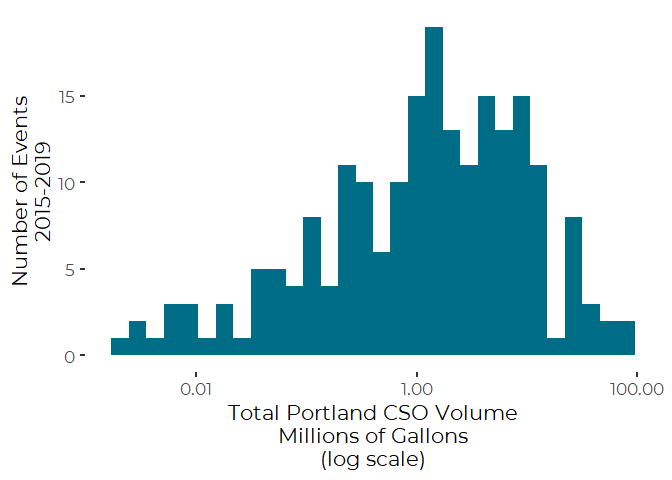
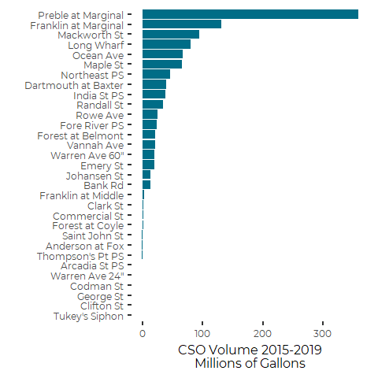
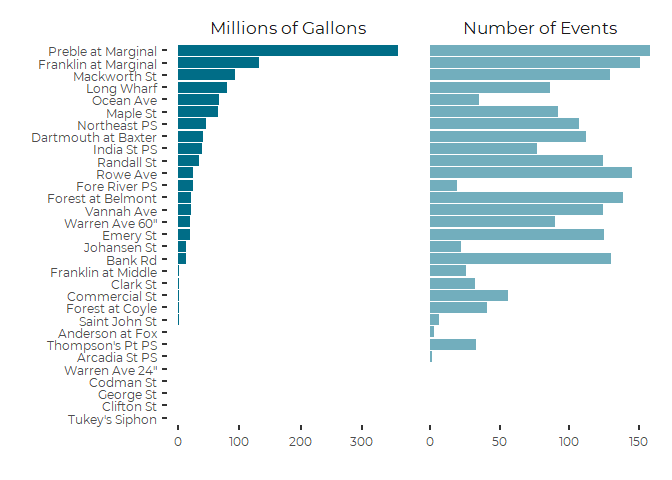
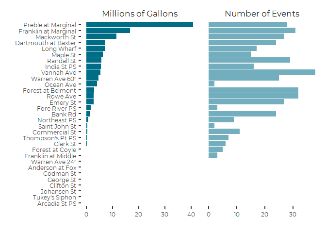
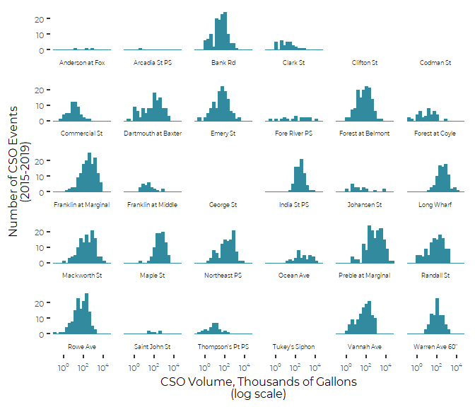
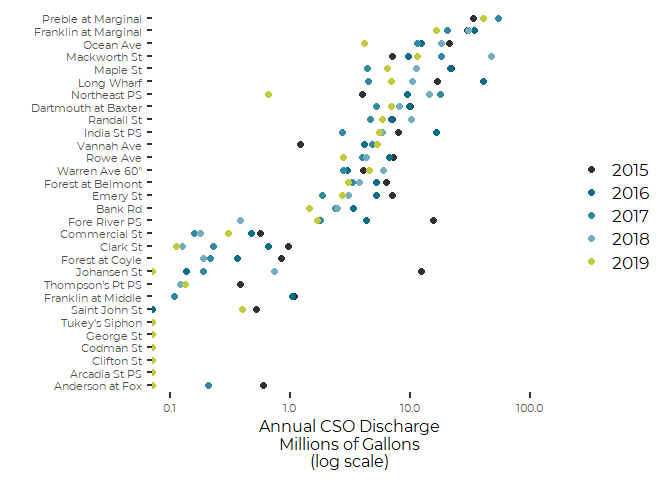
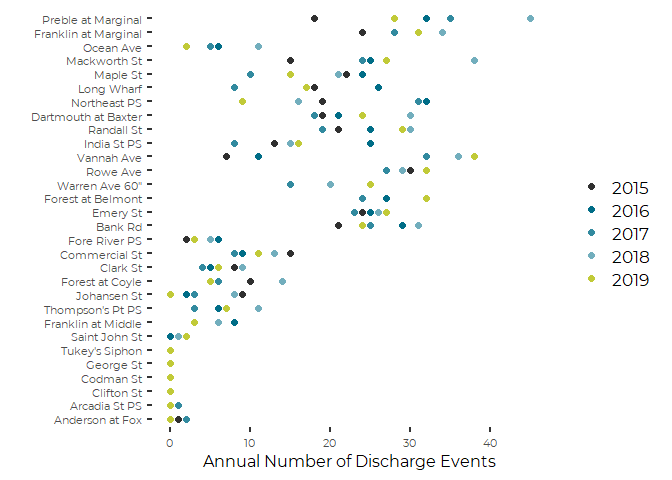
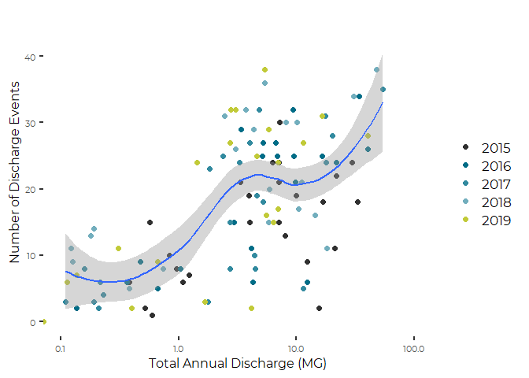

Casco Bay CSO Data Analysis, Portland CSO Graphics
================
Curtis C. Bohlen, Casco Bay Estuary Partnership

  - [Load Data](#load-data)
      - [Establish Folder References](#establish-folder-references)
      - [Load Core Data](#load-core-data)
      - [Load Locations Lookup Table](#load-locations-lookup-table)
      - [Load Weather Data](#load-weather-data)
          - [Modify Folder Reference](#modify-folder-reference)
          - [Access data](#access-data)
  - [Reformat Data](#reformat-data)
      - [Calculate Totals by CSO](#calculate-totals-by-cso)
          - [The two largest discharge
            CSOs](#the-two-largest-discharge-csos)
          - [How often have discharges exceeded planned storage
            capacity?](#how-often-have-discharges-exceeded-planned-storage-capacity)
      - [Calculate 2019 Data by CSO](#calculate-2019-data-by-cso)
      - [Calculate Totals by Event](#calculate-totals-by-event)
      - [Calculate Totals by Year](#calculate-totals-by-year)
          - [Total EEWTF Overflow](#total-eewtf-overflow)
          - [Compare to DEP Data](#compare-to-dep-data)
          - [Combine Annual Totals](#combine-annual-totals)
  - [Graphics](#graphics)
      - [Event Volumes Histogram](#event-volumes-histogram)
          - [Related Summary Statistics](#related-summary-statistics)
      - [Totals by CSO Barcharts](#totals-by-cso-barcharts)
          - [Drafts](#drafts)
          - [Combined Graphic](#combined-graphic)
      - [2019 by CSOs Barchart](#by-csos-barchart)
      - [Facetted Histograms of Discharges by
        CSO](#facetted-histograms-of-discharges-by-cso)
          - [CSOs That Did Not Discharge](#csos-that-did-not-discharge)
      - [Annual CSO Volumes a and Events as
        Dots](#annual-cso-volumes-a-and-events-as-dots)
      - [Annual discharge and annual
        events](#annual-discharge-and-annual-events)


\#Load Libraries

``` r
library(tidyverse)
#> -- Attaching packages ------------------------------------------------------------------- tidyverse 1.3.0 --
#> v ggplot2 3.3.2     v purrr   0.3.4
#> v tibble  3.0.3     v dplyr   1.0.2
#> v tidyr   1.1.2     v stringr 1.4.0
#> v readr   1.3.1     v forcats 0.5.0
#> -- Conflicts ---------------------------------------------------------------------- tidyverse_conflicts() --
#> x dplyr::filter() masks stats::filter()
#> x dplyr::lag()    masks stats::lag()
library(gridExtra)
#> 
#> Attaching package: 'gridExtra'
#> The following object is masked from 'package:dplyr':
#> 
#>     combine
library(corrplot)
#> corrplot 0.84 loaded

library(CBEPgraphics)
load_cbep_fonts()
theme_set(theme_cbep())
```

# Load Data

## Establish Folder References

``` r
sibfldnm <- 'Derived_Data'
parent   <- dirname(getwd())
sibling  <- file.path(parent,sibfldnm)

dir.create(file.path(getwd(), 'figures'), showWarnings = FALSE)
```

## Load Core Data

``` r
fn <-'Portland_CSO_data_2015_2019.csv'
fpath <- file.path(sibling, fn)
the_data <- read_csv(fpath, col_types = 
                       cols(.default = col_double(),
                                 firstdate = col_date(format = ""),
                                 lastdate = col_date(format = ""))) %>%
  select (-event)    # event only applies within years, and has no purpose here.
```

## Load Locations Lookup Table

``` r
fn <-'Portland_Locations.csv'
fpath <- file.path(sibling, fn)
locations_lookup <- read_csv(fpath, col_types = 
                             cols(CSO = col_character(),
                                  Location = col_character()))
```

## Load Weather Data

### Modify Folder Reference

``` r
sibfldnm <- 'Original_Data'
parent   <- dirname(getwd())
sibling  <- file.path(parent,sibfldnm)
```

### Access data

We extract annual Precipitation Totals (in mm), and Annual Days with
more than one tenth of an inch (2.5mm), and one inch (25.4mm) of rain
from the annual weather summaries from NOAA.

``` r
fn <-'Annual_Weather_PWD.csv'
fpath <- file.path(sibling, fn)
rain_data <- read_csv(fpath, col_types =
                       cols(date = col_datetime(format = ""),
                            datatype = col_character(),
                            value = col_double(),
                            attributes = col_character(),
                            station = col_skip())) %>%
  mutate(Year = as.integer(format(date, format = '%Y'))) %>%
  filter (datatype %in% c('PRCP', 'DP10', 'DP1X')) %>%
  select(Year, datatype, value) %>%
  pivot_wider(names_from = datatype, values_from = value) %>%
  rename(Precip_mm = PRCP, GT0.1 = DP10, GT1.0 = DP1X) %>%
  mutate(Precip_in = Precip_mm / 25.4) %>%
  filter(Year > 1996)
```

# Reformat Data

## Calculate Totals by CSO

``` r
totals_by_cso <- the_data %>%
  summarize(across(contains('CSO'),
                   c(Events = ~ sum(! is.na(.x) & .x>0),
                   Volume = ~ sum(.x, na.rm = TRUE)),
                   .names = paste0('{.col}_{.fn}'))) %>%
  t %>%         # t transposes, but also converts to an array, with dimnames
  tibble(Item = dimnames(.)[[1]]) %>%
  rename(Val = 1) %>%
  mutate(group = sub('^.*_', '', Item),
         CSO   = substr(Item, 1,7)) %>%
  pivot_wider(id_cols = CSO, names_from = group, values_from = Val) %>%
  mutate(VolumeMG = round(Volume/(10^6),2)) %>%
  inner_join(locations_lookup, by = 'CSO') %>%
  select(CSO, Location, Events, VolumeMG, Volume) %>%
  arrange(-Volume)
totals_by_cso
#> # A tibble: 31 x 5
#>    CSO     Location             Events[,1] VolumeMG[,1] Volume[,1]
#>    <chr>   <chr>                     <dbl>        <dbl>      <dbl>
#>  1 CSO_017 Preble at Marginal          158        358.   358445700
#>  2 CSO_018 Franklin at Marginal        151        131.   131461600
#>  3 CSO_010 Mackworth St                129         93.8   93815000
#>  4 CSO_025 Long Wharf                   86         79.4   79425000
#>  5 CSO_007 Ocean Ave                    35         67.3   67269000
#>  6 CSO_026 Maple St                     92         65.4   65427000
#>  7 CSO_020 Northeast PS                107         46.0   46045000
#>  8 CSO_015 Dartmouth at Baxter         112         40.1   40076000
#>  9 CSO_023 India St PS                  77         38.5   38526000
#> 10 CSO_005 Randall St                  124         34.5   34525000
#> # ... with 21 more rows
```

### The two largest discharge CSOs

``` r
tot = sum(totals_by_cso$Volume)
cso_17_tot <- sum(totals_by_cso$Volume[totals_by_cso$CSO == 'CSO_017'])
cso_18_tot <- sum(totals_by_cso$Volume[totals_by_cso$CSO == 'CSO_018'])
cat ('CSO_18 = ', cso_18_tot, '\n')
#> CSO_18 =  131461600
cat ('CSO_17 = ', cso_17_tot, '\n')
#> CSO_17 =  358445700
cat ('Two Largest = ', cso_18_tot + cso_17_tot, '\n')
#> Two Largest =  489907300
cat ('Total = ', tot, '\n\n')
#> Total =  1122829990
cat ('Pct_CSO_18 = ', cso_18_tot/tot, '\n')
#> Pct_CSO_18 =  0.1170806
cat ('Pct_CSO_17 = ', cso_17_tot/tot, '\n')
#> Pct_CSO_17 =  0.3192342
cat ('Pct Two Largest = ', (cso_18_tot + cso_17_tot)/tot, '\n')
#> Pct Two Largest =  0.4363148
```

### How often have discharges exceeded planned storage capacity?

``` r
the_data %>%
  select(firstdate, CSO_016, CSO_017, CSO_018) %>%
  pivot_longer(cols = CSO_016:CSO_018, names_to = 'CSO', values_to = 'Volume') %>%
  group_by(firstdate) %>%
  summarize(TotVol = sum(Volume, na.rm = TRUE),
            .groups = 'drop') %>%
  summarize(numexceeds = sum(TotVol > 3500000),
            num = n(),
            numwdischarge = sum(TotVol > 0))
#> # A tibble: 1 x 3
#>   numexceeds   num numwdischarge
#>        <int> <int>         <int>
#> 1         45   206           189
```

## Calculate 2019 Data by CSO

``` r
data_2019 <- the_data %>%
  
  filter(Year == 2019) %>%
  summarize(across(contains('CSO'),
                   c(Events = ~ sum(! is.na(.x) & .x>0),
                   Volume = ~ sum(.x, na.rm = TRUE)),
                   .names = paste0('{.col}_{.fn}'))) %>%
  t %>%         # t transposes, but also converts to an array, with dimnames
  tibble(Item = dimnames(.)[[1]]) %>%
  rename(Val = 1) %>%
  mutate(group = sub('^.*_', '', Item),
         CSO   = substr(Item, 1,7)) %>%
  pivot_wider(id_cols = CSO, names_from = group, values_from = Val) %>%
  mutate(VolumeMG = round(Volume/(10^6),2)) %>%
  inner_join(locations_lookup, by = 'CSO') %>%
  select(CSO, Location, Events, VolumeMG, Volume) %>%
  arrange(-Volume)
data_2019
#> # A tibble: 31 x 5
#>    CSO     Location               Events[,1] VolumeMG[,1] Volume[,1]
#>    <chr>   <chr>                       <dbl>        <dbl>      <dbl>
#>  1 CSO_017 "Preble at Marginal"           28        40.7    40724000
#>  2 CSO_018 "Franklin at Marginal"         31        16.6    16607000
#>  3 CSO_010 "Mackworth St"                 27        11.5    11485000
#>  4 CSO_015 "Dartmouth at Baxter"          24         6.98    6975100
#>  5 CSO_025 "Long Wharf"                   17         6.97    6970000
#>  6 CSO_026 "Maple St"                     15         6.38    6377000
#>  7 CSO_005 "Randall St"                   29         5.8     5799000
#>  8 CSO_023 "India St PS"                  16         5.56    5555000
#>  9 CSO_012 "Vannah Ave"                   38         5.36    5355000
#> 10 CSO_042 "Warren Ave 60\""              25         4.59    4593000
#> # ... with 21 more rows
```

## Calculate Totals by Event

The CALCULATED total volumes here incorporate some data corrections from
2019 that were missed in the source Excel File, so `eventtotal` and
`calcvolume` do not match exactly.

``` r
totals_by_event <- the_data %>%
  mutate(active_locs = rowSums(! is.na(.[grep("CSO", names(.))]) &
                                        .[grep("CSO", names(.))] > 0),
         calcvolume  = rowSums(.[grep("CSO", names(.))], na.rm = TRUE)) %>%
  select(-contains('CSO'))
totals_by_event
#> # A tibble: 206 x 9
#>    firstdate  lastdate    days totalprecip maxprecip eventtotal  Year
#>    <date>     <date>     <dbl>       <dbl>     <dbl>      <dbl> <dbl>
#>  1 2015-01-18 2015-01-19     2        0.69      0.23    1606300  2015
#>  2 2015-03-14 2015-03-15     2        0.83      0.18    1718000  2015
#>  3 2015-03-26 2015-03-27     2        0.59      0.12     615000  2015
#>  4 2015-04-10 2015-04-10     1        0.43      0.07     625000  2015
#>  5 2015-04-20 2015-04-23     4        3.81      0.5    50304000  2015
#>  6 2015-05-10 2015-05-10     1        0.48      0.44    3023000  2015
#>  7 2015-05-12 2015-05-12     1        0.19      0.18      27000  2015
#>  8 2015-05-19 2015-05-19     1        0.23      0.07       9600  2015
#>  9 2015-05-28 2015-05-29     2        1.08      0.64    3234000  2015
#> 10 2015-05-31 2015-06-02     3        2.84      0.31    8658000  2015
#> # ... with 196 more rows, and 2 more variables: active_locs <dbl>,
#> #   calcvolume <dbl>
```

## Calculate Totals by Year

The CALCULATED total volumes here incorporate some data corrections from
2019 that were missed in the source Excel File, so `eventtotal` and
`calcvolume` do not match exactly.

``` r
totals_by_year <- the_data %>%
  
  mutate(calcvolume  = rowSums(.[grep("CSO", names(.))], na.rm = TRUE)) %>%
  select(-contains('CSO')) %>%
  group_by(Year) %>%
  summarize(annualstormprecip = sum(totalprecip),
            annualreportvol = sum(eventtotal),
            annualcalcvol =  sum(calcvolume),
            annualevents = sum(! is.na(calcvolume)),
            .groups = 'drop') %>%
  left_join(rain_data)
#> Joining, by = "Year"
totals_by_year
#> # A tibble: 5 x 9
#>    Year annualstormprec~ annualreportvol annualcalcvol annualevents GT0.1 GT1.0
#>   <dbl>            <dbl>           <dbl>         <dbl>        <int> <dbl> <dbl>
#> 1  2015             35.1       221085900     221085900           35    74    10
#> 2  2016             37.1       318359690     318359690           38    72     8
#> 3  2017             34.5       164977000     164977000           39    78    12
#> 4  2018             45.3       290485700     290485700           49    86    15
#> 5  2019             37.1       128552700     127921700           45    89    12
#> # ... with 2 more variables: Precip_mm <dbl>, Precip_in <dbl>
```

### Total EEWTF Overflow

Data on total annual EEWWTF bypass flows was copied by hand from each
report from Portland Water District.

Note that the total CSO volume we show here for 2019 is slightly
different from the total reported in the Excel file, as that file
included two events from January of 2020. We have dropped those from our
analyses. It is not clear whether that invalidates the comparison to the
EEWTF bypass flows.

``` r
EEWTF_overflows <- tribble(
~Year, ~'Total CSO',    ~'EEWTF',
2015,     221085900,    165380000,
2016,     318359690,      178190000,
2017,     164977000,      211460000,
2018,   290485700,    337570000,
2019,   127921700,    248450000
)
EEWTF_overflows <- EEWTF_overflows %>%
  mutate(Total           = `Total CSO` + EEWTF,
         `EEWTF Percent` = round(EEWTF/Total,3)*100)

EEWTF_overflows %>%
  mutate(`Total CSO` = round(`Total CSO`/(10^6),2),
         EEWTF       = round( EEWTF     /(10^6),2),
         Total       = round( Total     /(10^6),2)) %>%
  knitr::kable(align = c('lrrrc'))
```

| Year | Total CSO |  EEWTF |  Total | EEWTF Percent |
| :--- | --------: | -----: | -----: | :-----------: |
| 2015 |    221.09 | 165.38 | 386.47 |     42.8      |
| 2016 |    318.36 | 178.19 | 496.55 |     35.9      |
| 2017 |    164.98 | 211.46 | 376.44 |     56.2      |
| 2018 |    290.49 | 337.57 | 628.06 |     53.7      |
| 2019 |    127.92 | 248.45 | 376.37 |     66.0      |

For comparison purposes, it is worth recalling that the EEWTF is
licensed to discharge \~ 18 MGD. On an annual basis, that would work out
to \(18 \times 365 = 6,570\) million gallons, or substantially more than
an order of magnitude higher than total wet weather discharges.

### Compare to DEP Data

Note that almost all our calculated values for Portland are LOWER than
values reported by DEP, but they are SIMILAR, except from Year 2019,
where the EPA numbers probably include the early 2020 storm event.

(code suppressed)

| Year | Cape Elizabeth | Portland & PWD | South Portland | Westbrook | Yarmouth |
| ---: | -------------: | -------------: | -------------: | --------: | -------: |
| 2015 |          0.277 |       254.6633 |      11.161602 |    4.4230 |       NA |
| 2016 |          0.251 |       318.3597 |       6.240350 |    7.4471 |       NA |
| 2017 |          0.277 |       175.6750 |       2.033229 |    1.2850 |       NA |
| 2018 |          0.375 |       283.6128 |       3.533710 |    1.6310 |       NA |
| 2019 |          0.432 |       184.4536 |       8.651990 |    9.8160 |       NA |

### Combine Annual Totals

``` r
totals_by_year <- totals_by_year %>%
  left_join(EEWTF_overflows, by = 'Year') %>%
  select(-annualreportvol, -Precip_mm, -Total, -`EEWTF Percent`)
```

# Graphics

## Event Volumes Histogram

``` r
plt <- totals_by_event %>%
  ggplot(aes(x = calcvolume/(10^6))) +
  geom_histogram(fill = cbep_colors()[1]) +
  ylab('Number of Events\n2015-2019') +
  xlab('Total Portland CSO Volume\nMillions of Gallons\n(log scale)') +
  scale_x_log10(labels = scales::label_comma()) 
plt
#> `stat_bin()` using `bins = 30`. Pick better value with `binwidth`.
```

<!-- -->

``` r
ggsave('figures/PortlandCSOeventhist.pdf', device = cairo_pdf, width = 5, height = 5)
#> `stat_bin()` using `bins = 30`. Pick better value with `binwidth`.
```

### Related Summary Statistics

``` r
totals_by_event %>%
  pull(calcvolume) %>%
  summary
#>     Min.  1st Qu.   Median     Mean  3rd Qu.     Max. 
#>     2000   279225  1404150  5450631  5932750 76692000
```

## Totals by CSO Barcharts

### Drafts

``` r
plt1 <- totals_by_cso %>%
  mutate(Location = factor(Location, levels = Location[order(Volume)])) %>%
  ggplot(aes(x = Location, y = VolumeMG)) +
  geom_col(fill = cbep_colors()[1]) +
  coord_flip() +
  theme(axis.text = element_text(size = 9),
        axis.title = element_text(size = 12)) +
  ylab('CSO Volume 2015-2019\nMillions of Gallons') +
  xlab('')
plt1
```

<!-- -->

``` r
rm(plt1)
```

``` r
plt2 <- totals_by_cso %>%
  mutate(Location = factor(Location, levels = Location[order(Volume)])) %>%
  ggplot(aes(x = Location, y = Events)) +
  geom_col(fill = cbep_colors()[6]) +
  coord_flip() +
  theme(axis.text = element_text(size = 9),
        axis.title = element_text(size = 12)) +
  ylab('Number of Storms with Overflows\n2015-2019') +
  xlab('')
plt2
```

<!-- -->

``` r
#ggsave('figures/PortlandCSOEvents5.pdf', device = cairo_pdf, width = 5, height = 5)
rm(plt2)
```

### Combined Graphic

What we want is a layout with those two next to each other, without
repeating the horizontal labels.

``` r
# New facet label names
the_labs <- c("Number of Events", "Millions of Gallons")
names(the_labs) <- c("Events", "VolumeMG")


plt3 <- totals_by_cso %>%
  mutate(Location = factor(Location, levels = Location[order(Volume)])) %>%
  select(-CSO, -Volume) %>%
  pivot_longer(cols = 2:3, names_to = 'Parameter', values_to = 'Value') %>%
  mutate(Parameter = factor(Parameter, levels = c('VolumeMG', 'Events'))) %>%
  
  ggplot(aes(x = Location, y = Value)) +
  geom_col(aes(fill = Parameter)) +
  scale_fill_manual(values = cbep_colors2()[c(2,4)], name = '') +
  
  coord_flip() +
  facet_grid(cols = vars(Parameter),
            scales = "free",
            labeller = labeller(Parameter = the_labs)) +

  theme(axis.text = element_text(size = 9),
        axis.title = element_text(size = 12),
        legend.position = "none") +
  xlab('') +
  ylab('')
 
plt3
```

<!-- -->

``` r
ggsave('figures/PortlandCSO5.pdf', device = cairo_pdf, width = 5, height = 5)
rm(plt3)
```

## 2019 by CSOs Barchart

``` r
# New facet label names
the_labs <- c("Number of Events", "Millions of Gallons")
names(the_labs) <- c("Events", "VolumeMG")

plt4 <- data_2019 %>%
  mutate(Location = factor(Location, levels = Location[order(Volume)])) %>%
  select(-CSO, -Volume) %>%
  pivot_longer(cols = 2:3, names_to = 'Parameter', values_to = 'Value') %>%
  mutate(Parameter = factor(Parameter, levels = c('VolumeMG', 'Events'))) %>%
  
  ggplot(aes(x = Location, y = Value)) +
  geom_col(aes(fill = Parameter)) +
  scale_fill_manual(values = cbep_colors2()[c(2,4)], name = '') +
  
  coord_flip() +
  facet_grid(cols = vars(Parameter),
            scales = "free",
            labeller = labeller(Parameter = the_labs)) +

  theme(axis.text = element_text(size = 9),
        axis.title = element_text(size = 12),
        legend.position = "none") +
  xlab('') +
  ylab('')
 
plt4
```

<!-- -->

``` r
ggsave('figures/PortlandCSO2019.pdf', device = cairo_pdf, width = 7, height = 5)
rm(plt4)
```

## Facetted Histograms of Discharges by CSO

``` r
plt5 <- the_data %>% 
  select(firstdate, totalprecip, maxprecip, everything()) %>%
  
  select (firstdate, Year, days, everything(), -eventtotal, -lastdate) %>%
  pivot_longer(cols = CSO_002:CSO_042,
               names_to = 'CSO',
               values_to = 'Volume') %>%
  mutate(Volume = Volume/(10^3)) %>%
  left_join(locations_lookup, by = 'CSO') %>%
  
  ggplot(aes(x = Volume)) +
  geom_histogram(bins = 20, fill = cbep_colors()[5], color = cbep_colors()[5]) +
  scale_x_log10(breaks = 10^(c(0, 2, 4)),
                labels = scales::trans_format("log10", scales::math_format(10^.x))) +
  
  facet_wrap(~Location, strip.position = 'bottom') +
  theme(axis.text = element_text(size = 8), 
        strip.text = element_text(size = 6),
        axis.title = element_text(size = 12))+
        #panel.border = element_rect(fill = NA, color = 'gray', size = 0.25) ) +
  
  ylab('Number of CSO Events\n(2015-2019)') +
  xlab('CSO Volume, Thousands of Gallons\n(log scale)')
plt5
#> Warning: Transformation introduced infinite values in continuous x-axis
#> Warning: Removed 4117 rows containing non-finite values (stat_bin).
```

<!-- -->

``` r
ggsave('figures/PortlandCSOhist.pdf', device = cairo_pdf, width = 7, height = 6)
#> Warning: Transformation introduced infinite values in continuous x-axis

#> Warning: Removed 4117 rows containing non-finite values (stat_bin).
```

### CSOs That Did Not Discharge

``` r
knitr::kable(totals_by_cso[which(totals_by_cso$Events==0),1:2])
```

| CSO      | Location       |
| :------- | :------------- |
| CSO\_004 | Tukey’s Siphon |
| CSO\_008 | Clifton St     |
| CSO\_009 | George St      |
| CSO\_011 | Codman St      |
| CSO\_043 | Warren Ave 24" |

## Annual CSO Volumes a and Events as Dots

``` r
plt6 <- the_data %>% 
  select(firstdate, totalprecip, maxprecip, everything()) %>%
  
  select (firstdate, Year, days, everything(), -eventtotal, -lastdate) %>%
  pivot_longer(cols = CSO_002:CSO_042,
               names_to = 'CSO',
               values_to = 'Volume') %>%
  mutate(Volume = Volume/(10^6)) %>%
  left_join(locations_lookup, by = 'CSO') %>%
  group_by(Year, CSO) %>%
  summarize(Location = first(Location),
            Volume = sum(Volume, na.rm = TRUE),
            .groups = 'drop') %>%
  mutate(Year = factor(Year)) %>%
  mutate(Location = fct_reorder(Location, Volume)) %>%

  ggplot(aes(Volume, Location, color = Year)) +
  geom_point(size = 2) +
  
  scale_color_manual(values = cbep_colors2(), name = '') +
    
  xlab("Annual CSO Discharge\nMillions of Gallons\n(log scale)") +
  ylab('') +
  
  #ggtitle('Portland CSO Discharges 2015-2019') +
  scale_x_log10(limits = c(0.1,100), breaks = c(0.1,1,10, 100)) +

  theme(title = element_text( size = 14),
        axis.text = element_text(size = 8), 
        strip.text = element_text(size = 6),
        axis.title = element_text(size = 12))
plt6
#> Warning: Transformation introduced infinite values in continuous x-axis
#> Warning: Removed 10 rows containing missing values (geom_point).
```

<!-- -->

``` r
#ggsave('figures/PortlandCSODots.pdf',
#       device = cairo_pdf, width = 7, height = 5)
```

``` r
plt6 <- the_data %>% 
  select(firstdate, totalprecip, maxprecip, everything()) %>%
  
  select (firstdate, Year, days, everything(), -eventtotal, -lastdate) %>%
  pivot_longer(cols = CSO_002:CSO_042,
               names_to = 'CSO',
               values_to = 'Volume') %>%
  mutate(Volume = Volume/(10^6)) %>%
  left_join(locations_lookup, by = 'CSO') %>%
  group_by(Year, CSO) %>%
  summarize(Location = first(Location),
            Events = sum(Volume>0, na.rm = TRUE),
            Volume = sum(Volume, na.rm = TRUE),
            .groups = 'drop') %>%
  mutate(Year = factor(Year)) %>%
  mutate(Location = fct_reorder(Location, Volume)) %>%

  ggplot(aes(Events, Location, color = Year)) +
  geom_point(size = 2) +
  
  scale_color_manual(values = cbep_colors2(), name = '') +
    
  xlab("Annual Number of Discharge Events") +
  ylab('') +
  
  #ggtitle('Portland CSO Discharges 2015-2019') +
  #scale_x_log10(limits = c(0.1,100), breaks = c(0.1,1,10, 100)) +

  theme(title = element_text( size = 14),
        axis.text = element_text(size = 8), 
        strip.text = element_text(size = 6),
        axis.title = element_text(size = 12))
plt6
```

<!-- -->

``` r
#ggsave('figures/PortlandCSODotsEvents.pdf',
#        device = cairo_pdf, width = 7, height = 5)
```

## Annual discharge and annual events

``` r
plt7 <- the_data %>% 
  select(firstdate, totalprecip, maxprecip, everything()) %>%
  
  select (firstdate, Year, days, everything(), -eventtotal, -lastdate) %>%
  pivot_longer(cols = CSO_002:CSO_042,
               names_to = 'CSO',
               values_to = 'Volume') %>%
  mutate(Volume = Volume/(10^6)) %>%
  left_join(locations_lookup, by = 'CSO') %>%
  group_by(Year, CSO) %>%
  summarize(Location = first(Location),
            Events = sum(Volume>0, na.rm = TRUE),
            Volume = sum(Volume, na.rm = TRUE),
            .groups = 'drop') %>%
  mutate(Year = factor(Year)) %>%
  mutate(Location = fct_reorder(Location, Volume)) %>%

  ggplot(aes(Volume, Events)) +
  geom_point(aes(color = Year), size = 2) +
  geom_smooth() +
  
  scale_color_manual(values = cbep_colors2(), name = '') +
    
  xlab("Total Annual Discharge (MG)") +
  ylab('Number of Discharge Events') +
  #ggtitle('Portland CSO Discharges 2015-2019') +
  scale_x_log10(limits = c(0.1,100), breaks = c(0.1,1,10, 100)) +

  theme(title = element_text( size = 14),
        axis.text = element_text(size = 8), 
        strip.text = element_text(size = 6),
        axis.title = element_text(size = 12))
plt7
#> Warning: Transformation introduced infinite values in continuous x-axis

#> Warning: Transformation introduced infinite values in continuous x-axis
#> `geom_smooth()` using method = 'loess' and formula 'y ~ x'
#> Warning: Removed 39 rows containing non-finite values (stat_smooth).
#> Warning: Removed 10 rows containing missing values (geom_point).
```

<!-- -->

``` r
#ggsave('figures/PortlandCSOvolbyevents.pdf',
#       device = cairo_pdf, width = 7, height = 5)
```
