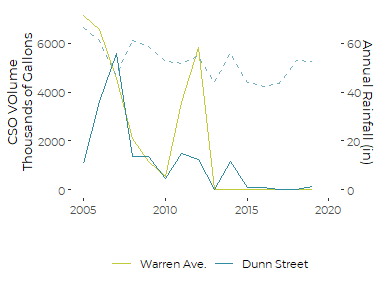
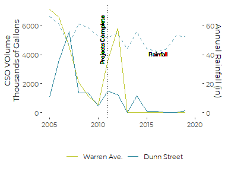
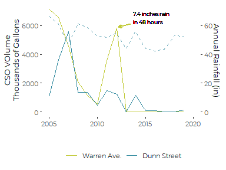
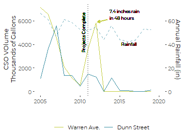
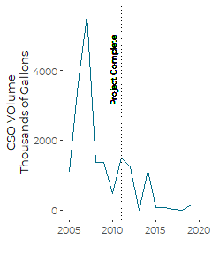

Casco Bay CSO Data Analysis, Portland CSO Graphics
================
Curtis C. Bohlen, Casco Bay Estuary Partnership

  - [Load Data](#load-data)
      - [Establish Folder References](#establish-folder-references)
      - [Load Data](#load-data-1)
      - [Load Weather Data](#load-weather-data)
          - [Access data](#access-data)
      - [Combine Data](#combine-data)
      - [Load Locations Lookup Table](#load-locations-lookup-table)
  - [Graphics](#graphics)
      - [Combined Graphic, One Panel](#combined-graphic-one-panel)
  - [Dunn Street Alone](#dunn-street-alone)


\#Load Libraries

``` r
library(tidyverse)
#> -- Attaching packages ----------------------------------------------------------------------------------- tidyverse 1.3.0 --
#> v ggplot2 3.3.2     v purrr   0.3.4
#> v tibble  3.0.3     v dplyr   1.0.2
#> v tidyr   1.1.2     v stringr 1.4.0
#> v readr   1.3.1     v forcats 0.5.0
#> -- Conflicts -------------------------------------------------------------------------------------- tidyverse_conflicts() --
#> x dplyr::filter() masks stats::filter()
#> x dplyr::lag()    masks stats::lag()
library(readxl)

library(CBEPgraphics)
load_cbep_fonts()
theme_set(theme_cbep())
```

# Load Data

## Establish Folder References

``` r
sibfldnm   <- 'Original_Data'
niecefldnm <- 'PWD_Remediation'
parent     <- dirname(getwd())
sibling    <- file.path(parent,sibfldnm)
niece      <- file.path(sibling, niecefldnm)

dir.create(file.path(getwd(), 'figures'), showWarnings = FALSE)
```

## Load Data

``` r
fn <- "CSO-002_and_CSO-004_Annual_Overflow_Volumes.xlsx"
fpath <- file.path(niece, fn)
remediation_data <- read_excel(fpath, skip = 1,
                           col_types = c("numeric", "numeric", "numeric"),
                           col_names = c('Year', 'CSO_002', 'CSO_004'))

remediation_long <- remediation_data %>%
  pivot_longer(cols = c(2:3), names_to = 'CSO', values_to = 'Volume')
```

## Load Weather Data

### Access data

We extract annual Precipitation Totals (in mm), and Annual Days with
more than one tenth of an inch (2.5mm), and one inch (25.4mm) of rain
from the annual weather summaries from NOAA.

``` r
fn <-'Annual_Weather_PWD.csv'
fpath <- file.path(sibling, fn)
rain_data <- read_csv(fpath, col_types =
                       cols(date = col_datetime(format = ""),
                            datatype = col_character(),
                            value = col_double(),
                            attributes = col_character(),
                            station = col_skip())) %>%
  mutate(Year = as.integer(format(date, format = '%Y'))) %>%
  filter (datatype %in% c('PRCP', 'DP10', 'DP1X')) %>%
  select(Year, datatype, value) %>%
  pivot_wider(names_from = datatype, values_from = value) %>%
  rename(Precip_mm = PRCP, GT0.1 = DP10, GT1.0 = DP1X) %>%
  mutate(Precip_in = Precip_mm / 25.4) %>%
  filter(Year > 2004)
```

## Combine Data

``` r
remediation_data <- remediation_data %>%
  left_join(rain_data, by = 'Year')
```

## Load Locations Lookup Table

``` r

locations_lookup <- tribble(
  ~CSO, ~Location,
'CSO_002', 'Warren Ave.',
'CSO_004', 'Dunn Street')

remediation_long <- remediation_long%>%
  left_join(locations_lookup, by = 'CSO')
```

# Graphics

## Combined Graphic, One Panel

``` r
labs = locations_lookup$Location
names(labs) = locations_lookup$CSO


plt <- ggplot(remediation_long) +
  # Basic Plot
  geom_line(aes(x = Year, y = Volume/10^3, color = CSO)) +
  
  geom_line(data = remediation_data,
            mapping = aes(x = Year, y = Precip_in * 100 ),
            color = cbep_colors()[6],
            lty = 2) +
   
  # Axis Labels
  ylab('CSO VOlume\nThousands of Gallons') +
  xlab('')  +

  # Changing Formats
  theme_cbep(base_size = 10) +
  scale_color_manual(values = cbep_colors()[c(4,5)],
                     name = '',
                     labels = labs) +
  scale_y_continuous(sec.axis = sec_axis(~ . /100,
                                         name = 'Annual Rainfall (in)')) +
  scale_x_continuous(limits = c(2005, 2020)) +

  theme(legend.position = 'bottom')
plt
```

<!-- -->

``` r
plt2 <- plt +
  geom_vline(xintercept = 2011, lty = 3) +
  geom_text(x = 2016.2, y = 4050,
            label = 'Rainfall',
            size = 2.5) +
  geom_text(x = 2010.4, y = 6700,
            label = 'Projects Complete',
            angle = 90,
            size = 2.5,
            hjust = 1)
plt2
```

<!-- -->

``` r
plt3 <- plt +
  geom_text(x = 2013.75,  y = 6550,
             label= '7.4 inches rain\nin 48 hours',
             size = 2.5,
             hjust = 0) +

  # Add arrow
  annotate("segment",
           x = 2013.5, xend = 2012.2,
           y = 6100, yend = 5900,
           color = cbep_colors()[4],
           size=1,arrow=arrow(length = unit(5, 'points')))
plt3
```

<!-- -->

``` r
plt4 <- plt2 +
  geom_text(x = 2013.75,  y = 6550,
             label= '7.4 inches rain\nin 48 hours',
             size = 2.5,
             hjust = 0) +

  # Add arrow
  annotate("segment",
           x = 2013.5, xend = 2012.2,
           y = 6100, yend = 5900,
           color = cbep_colors()[4],
           size=1,arrow=arrow(length = unit(5, 'points')))
plt4
```

<!-- -->

``` r

ggsave('figures/Westbrook_CSO_Highlight_Sites_one_panel.pdf',
        device = cairo_pdf, width = 4, height = 3)
```

# Dunn Street Alone

``` r

plt  <- remediation_long %>%
  filter(Location == 'Dunn Street') %>%
  
  #Basic Plot
  ggplot(aes(x = Year, y = Volume/10^3)) +
  # Basic Plot
  geom_line(color = cbep_colors()[1]) + 
    
  # Add Project Annotation
  geom_vline(xintercept = 2011, lty = 3) +
  geom_text(x = 2010, y = 5000,
            label = 'Project Complete',
            angle = 90,
            size = 2.5,
            hjust = 1) +

  # Axis Labels
  ylab('CSO VOlume\nThousands of Gallons') +
  xlab('')  +

  # Changing Formats
  theme_cbep(base_size = 10) +
  # scale_y_continuous(sec.axis = sec_axis(~ . /100,
  #                                        name = 'Annual Rainfall (in)')) +
  scale_x_continuous(limits = c(2005, 2020)) +

  theme(legend.position = 'bottom')
plt
```

<!-- -->

``` r
ggsave('figures/Dunn_Street_Example.pdf',
        device = cairo_pdf, width = 4, height = 3)
```
